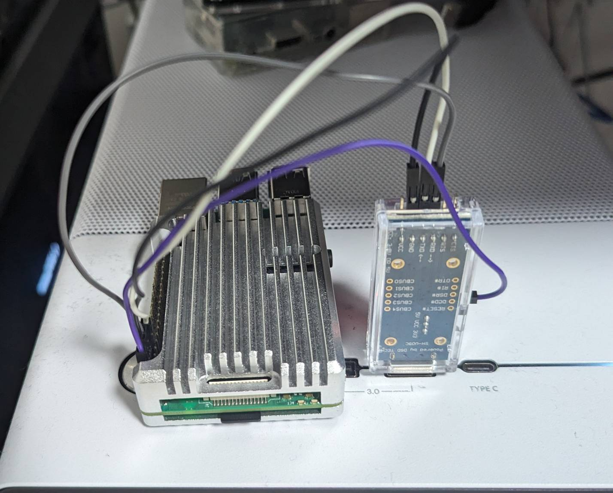
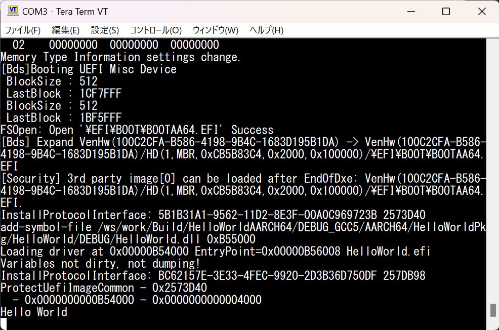

# Raspi uefi apps
The purpose of raspi-uefi-apps is to provide sample UEFI applications and reproducible build instructions for raspberry pi. Raspberry Pi3 and Raspberry Pi4 are cullently supported.

## System requirements

I only tested following build environment.   
Reproducibility can not be guaranteed in others.

```
$ cat /etc/os-release | grep VERSION
VERSION_ID="22.04"
VERSION="22.04.3 LTS (Jammy Jellyfish)"
VERSION_CODENAME=jammy

$ cat /proc/cpuinfo | grep "model name" | head -n 1
model name      : 13th Gen Intel(R) Core(TM) i5-13600K
```

It is recommended to prepare above ubuntu environment using WSL or Docker.

## Install toolchains
If you build on the X64 machine, you need to install optional toolchains for cross compiling.

```
$ sudo apt update
$ sudo apt install -y iasl make git uuid-dev g++ qemu-system-aarch64

# optional(for cross compilling)
$ sudo apt install -y gcc-aarch64-linux-gnu
```

## Setup
The raspi-uefi-apps uses [EDKⅡ](https://github.com/tianocore/edk2) to build app and firmware for raspberry pi. Please checkout to git ref/hash as I specified because latest combination does not work well.

* Repository setup

```:bash
$ mkdir ~/work

$ cd ~/work
$ git clone https://github.com/tianocore/edk2.git
$ cd edk2
$ git checkout edk2-stable202211
$ git submodule update --init

$ cd ~/work
$ git clone https://github.com/tianocore/edk2-platforms.git
$ edk2-platforms
$ git checkout d4fc36a523

$ cd ~/work
$ git clone https://github.com/tianocore/edk2-non-osi.git
$ cd edk2-non-osi
$ git checkout 61b65fccfe

$ cd ~/work
$ git clone https://github.com/tnken/raspi-uefi-app.git
$ cd raspi-uefi-app
```

* Environment variable setup

```
$ cd ~/work

$ export WORKSPACE=$PWD
$ export PACKAGES_PATH=$PWD/edk2:$PWD/edk2-platforms:$PWD/edk2-non-osi
$ export GCC5_AARCH64_PREFIX=aarch64-linux-gnu-
$ . edk2/edksetup.sh
```

* Build basetools
```
$ cd ~/work
$ make -C edk2/BaseTools
```

## List of apps
TBD.

See [src](./src/).

## Run on device
### 1. Build firmware
The Raspberry Pi load firmware from an SD card instead of some ROM chip, so you have to prepare UEFI firmware by yourself. The built firmware is output to `~/work/Build/RPi4/DEBUG_GCC5/FV/RPI_EFI.fd`.

```
$ cd ~/work

# for raspi4
$ build -a AARCH64 -t GCC5 -p Platform/RaspberryPi/RPi4/RPi4.dsc

# for raspi3
# $ build -a AARCH64 -t GCC5 -p Platform/RaspberryPi/# RPi3/RPi3.dsc
```

### 2. Build app
Build [HelloWorldPkg](./src/HelloWorldPkg/) as an example. The built app will be  output to
`work/Build/HelloWorldAARCH64/DEBUG_GCC5/AARCH64/HelloWorld.efi`

```
$ cd ~/work/edk2
$ ln -s $WORKSPACE/raspi-uefi-app/src/HelloWorldPkg/ HelloWorldPkg

$ cd ~/work
$ build -a AARCH64 -t GCC5 -p edk2/HelloWorldPkg/HelloWorld.dsc
```

### 3. Create bootable sd card

Download raspberry pi proprietary firmwares: [`start4.elf`](https://github.com/raspberrypi/firmware/blob/master/boot/start4.elf), [`fixup4.dat`](https://github.com/raspberrypi/firmware/blob/master/boot/fixup4.dat), [`disable-bt.dtbo`](https://github.com/raspberrypi/firmware/blob/master/boot/overlays/disable-bt.dtbo), [`bcm2711-rpi-4-b.dtb`](https://github.com/raspberrypi/firmware/blob/master/boot/bcm2711-rpi-4-b.dtb) from [raspberrypi/firmware](https://github.com/raspberrypi/firmware/tree/master.).

And create `config.txt` and edit like this.

```
arm_64bit=1
enable_uart=1
enable_gic=1
armstub=RPI_EFI.fd
disable_commandline_tags=2
device_tree_address=0x1f0000
device_tree_end=0x200000
```

And then, rename HelloWorld.efi to `BOOTAA64.EFI`. UEFI will automatically load and execute BOOTAA64.EFI when it finds in booting process.

Finally, put each file on the SD card as follows.

```
// for raspi4
├── EFI
│   └── BOOT
│       └── BOOTAA64.efi
├── overlays
│   └── disable-bt.dtbo
├── config.txt
├── fixup4.dat
├── RPI_EFI.fd
└── start4.elf
```

### 4. Check on serial console
The serial console can be used to check if the application is working.

First, please prepare USB to TTL serial adapber and connect to your host pc. I used [DSD TECH SH-U09C USB to TTL Serial Adapter](https://www.amazon.com/DSD-TECH-Adapter-FT232RL-Compatible/dp/B07BBPX8B8/ref=sr_1_1?crid=3LVVGFRJ31EXH&dib=eyJ2IjoiMSJ9.PNwZ6ssPpvVwJXQKGI-AtuDlTmj9Hk0aNWY3KVEkDDflr_iBYVQUhiGKAunRZEaUPSHBl8vFeqCwv0uZMkYwQQdS4Fw6Gg7mbhZdVr-cDCh0uYNxWT93tBrPFv2O4Ga1bD6QMrwkpt-CHuq9NeDQeTW-oRwlSIUF1ixF3UxpzjmpYDnDn_8dMykXch33vy4CFJ9poGIKK845oDxU3or_Upj2Y3bb3jvv0f3lQygDGBs.wMcJL5uUcNfCZRO_fomZsaf5oSUO3GpAw8hptBrUHEY&dib_tag=se&keywords=DSD+TECH+SH-U09C+USB+to+TTL+Serial+Adapter+with+FTDI+FT232RL+Chip+Compatible+with+Windows+11%2C+10%2C+7+and+Mac+OS&qid=1713096771&sprefix=%2Caps%2C218&sr=8-1).



Second, please set SD card on your raspberry pi, and turn on power, then please check serial console. I used [TeraTerm](https://teratermproject.github.io/index-en.html) as a serial console. Set speed=115200.

You can find `Hello World` is printed on console.



## Run on qemu
### 1. Create disk image
### 2. Run on qemu

